# 调试页面元素

在(用`selenium`、`puppeteer`、`playwright`等)自动化操作浏览器期间，往往涉及到：

搞清楚当前页面中的某些元素的html源码，以便于转换成`xpath`或`css selector`等方式去定位查找元素。

而调试页面元素的最常用办法就是：`Chrome`的`开发者工具`

其中：`Chrome`=`Chromium`

下面通过此处用到的实例例子来说明，具体如何操作。

## 用Chrome或Chromium查看百度首页中各元素的html源码

### 查看百度首页title标题

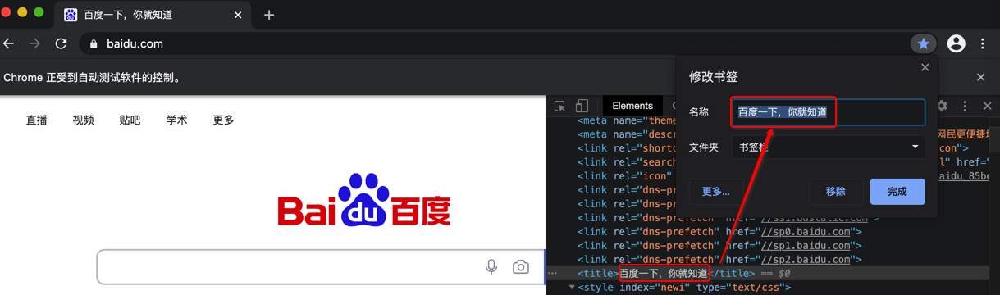

即：`百度一下，你就知道`

### 找到输入框对应的元素

可以右键 输入框 检查

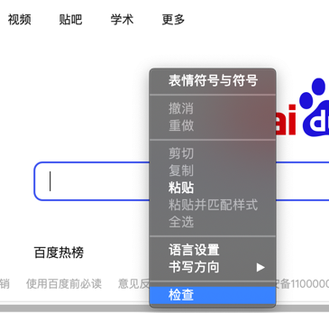

打开 Chrome的 开发者工具


可以看到对应的html，且可以右键去Copy拷贝出来对应html

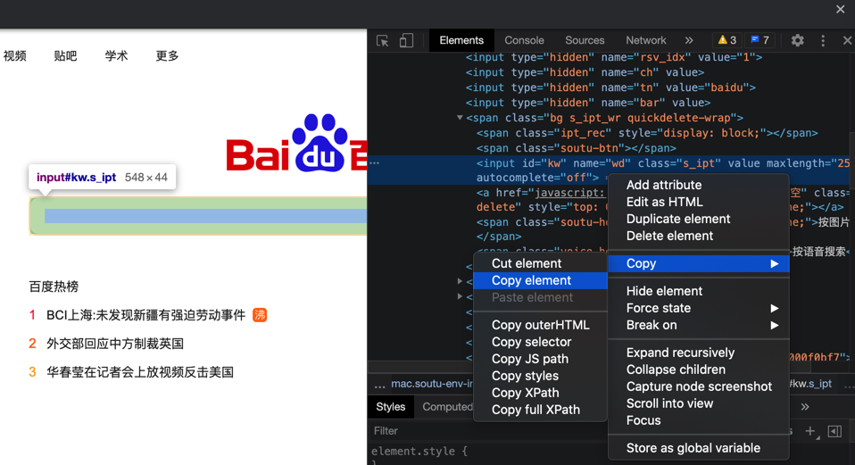

另外 Playwright调用的Chromium中效果是：

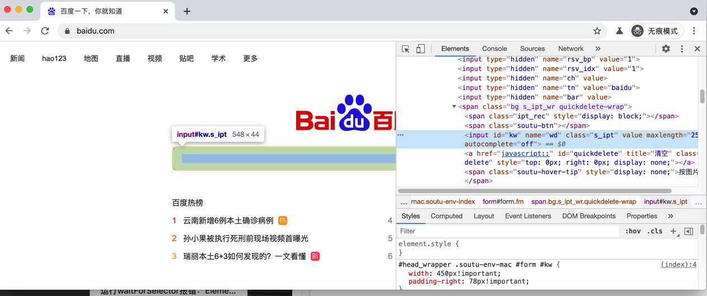

拷贝出来是：

```html
<input id="kw" name="wd" class="s_ipt" value="" maxlength="255" autocomplete="off">
```

后来注意到：

Chromium中 调试工具已实时显示出 定位元素的Selector的，可以写成：

```css
input#kw.s_ipt
```

其中：

* `input`：元素名`tag`
* `kw`：是`id`
* `s_ipt`：是`class`

—> 后续代码中定位元素的CSS的Selector，则可以借鉴，甚至直接用这个写法

#### 确认id是否唯一

此处可以通过查找，确认此处的id值`kw`是否唯一：

去搜一下此处的id：`kw`

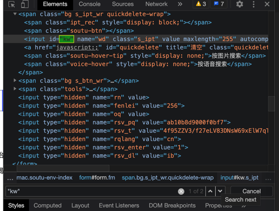

此处可以看到搜到了2个，不过很明显，另外一个不是id：

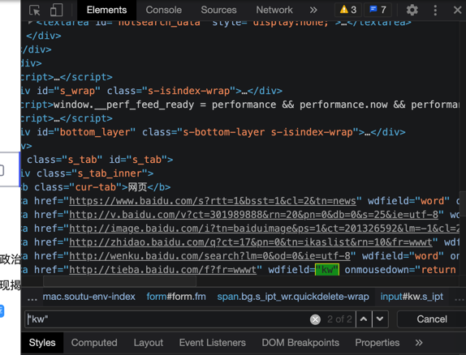

证明对于：`id="kw"`是唯一的

->后续代码，可以直接用`id="kw"`去定位元素（而可以不用其他属性，比如class等值）

### 找 百度一下 按钮的html

找 百度一下 按钮，和之前类似，去 右键检查：

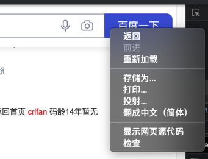

可以看到html是：

```html
<input type="submit" id="su" value="百度一下" class="bg s_btn">
```

且搜了下，确保只有一个：`"su"`

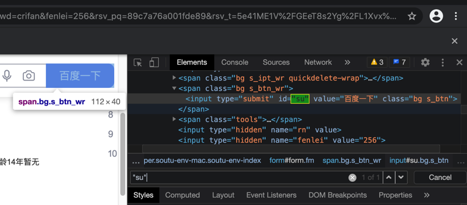

### 找到百度搜索页面肯定会出现的元素：百度为您找到相关结果约

去找百度搜索后，确保会出现的内容

找到这个：

```bash
百度为您找到相关结果约xxx个
```

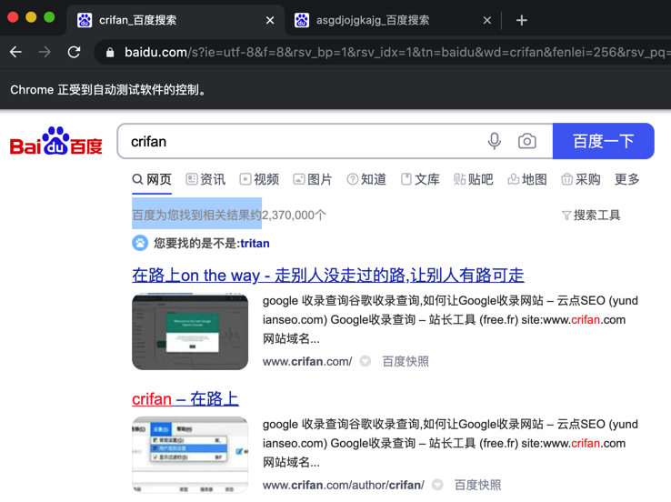

且去确认了，故意搜不到内容，页面也会出现这个：

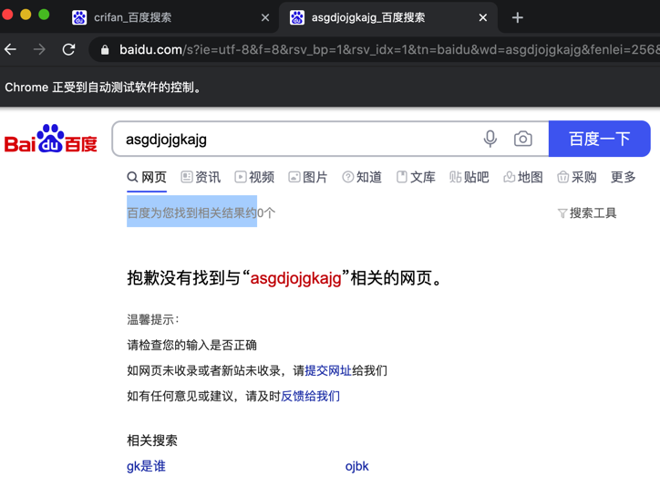

去看看其html：

```html
<span class="nums_text">百度为您找到相关结果约2,370,000个</span>
```

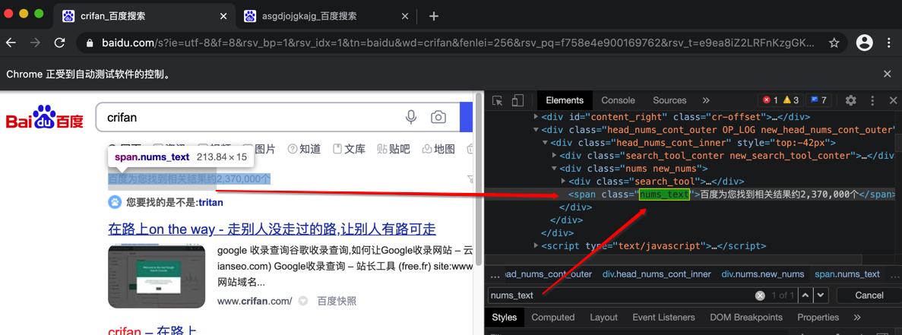

### 百度搜索的每条结果的html

去搞清楚，本身此处的每条搜索结果的内容的html是什么

右键 检查：

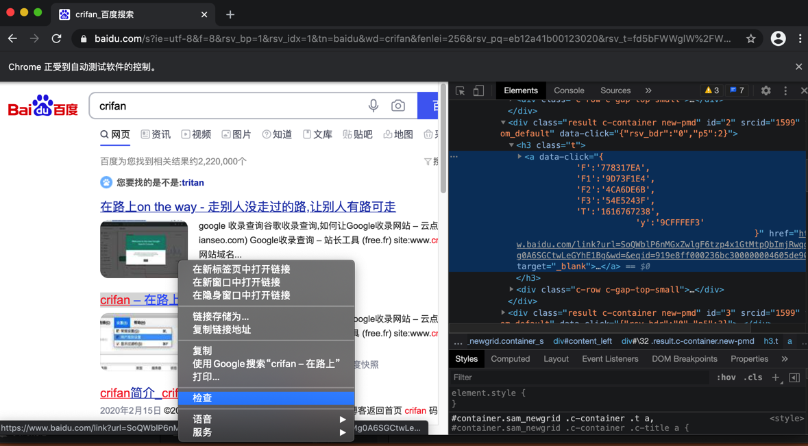

找到是：

```html
<a data-click="{
            'F':'778317EA',
            'F1':'9D73F1E4',
            'F2':'4CA6DE6B',
            'F3':'54E5243F',
            'T':'1616767238',
                'y':'9CFFFEF3'
                                }" href="https://www.baidu.com/link?url=SoQWblP6nMGxZwlgF6tzp4x1GtMtpQbImjRwqok-NChASMg0A6SGCtwLeGYhE1Bg&wd=&eqid=919e8ff000236bc300000004605de906" target="_blank"><em>crifan</em> – 在路上</a>
```

上层父节点的元素是：

```html
<h3 class="t"><a data-click="{
            'F':'778317EA',
            'F1':'9D73F1E4',
            'F2':'4CA6DE6B',
            'F3':'54E5243F',
            'T':'1616767238',
                'y':'9CFFFEF3'
                                }" href="https://www.baidu.com/link?url=SoQWblP6nMGxZwlgF6tzp4x1GtMtpQbImjRwqok-NChASMg0A6SGCtwLeGYhE1Bg&wd=&eqid=919e8ff000236bc300000004605de906" target="_blank"><em>crifan</em> – 在路上</a></h3>
```

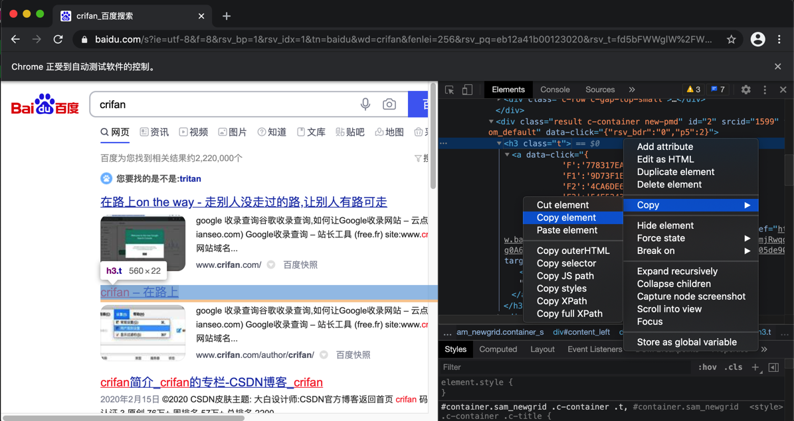

多看看几个结果，是否都是同样格式：

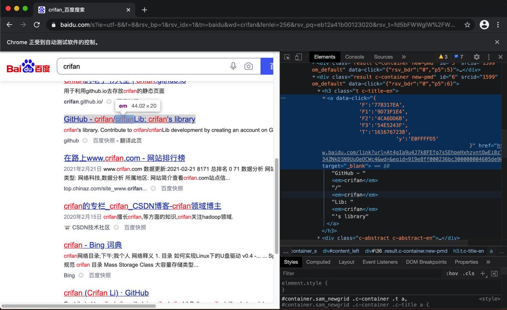

这个稍微复杂点：

```html
<h3 class="t c-title-en"><a data-click="{
            'F':'778317EA',
            'F1':'9D73F1E4',
            'F2':'4CA6DD6B',
            'F3':'54E5243F',
            'T':'1616767238',
                        'y':'E0FFFFD5'
                                                }" href="https://www.baidu.com/link?url=At4gIa9u4J7k8FEfq7sSEhpeHxhzyntQwEi8zTkeWpSbv_34ZNkD1N9UuQeOCWc4&wd=&eqid=919e8ff000236bc300000004605de906" target="_blank">GitHub - <em>crifan</em>/<em>crifan</em>Lib: <em>crifan</em>'s library</a></h3>
```

以及另外一个：

```html
<h3 class="t"><a data-click="{
            'F':'778317EA',
            'F1':'9D73F1E4',
            'F2':'4CA6DE6B',
            'F3':'54E5243F',
            'T':'1616767238',
                        'y':'EFBCEFBE'
                                                }" href="https://www.baidu.com/link?url=nDSbU9I2MSInD6Tq7Je06wZD-CiTQ-ckokscP4kiXneJcS0UWUPIqWHMjLDyn5uW&wd=&eqid=919e8ff000236bc300000004605de906" target="_blank"><em>crifan</em> (<em>Crifan</em> Li) · GitHub</a></h3>
```

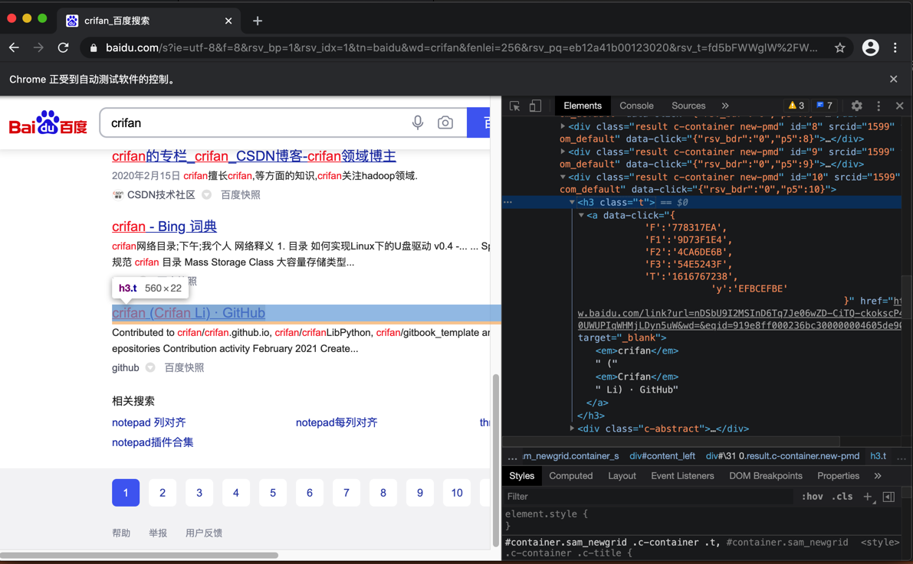

## 常见问题

> #### warning:: Playwright的Chromium中无法右键拷贝元素html
> 
> Playwright的Chromium中，虽然能打开 `开发者工具` 
> 
> 但是，右键无法复制copy元素的html，右键的copy是空
> 
> 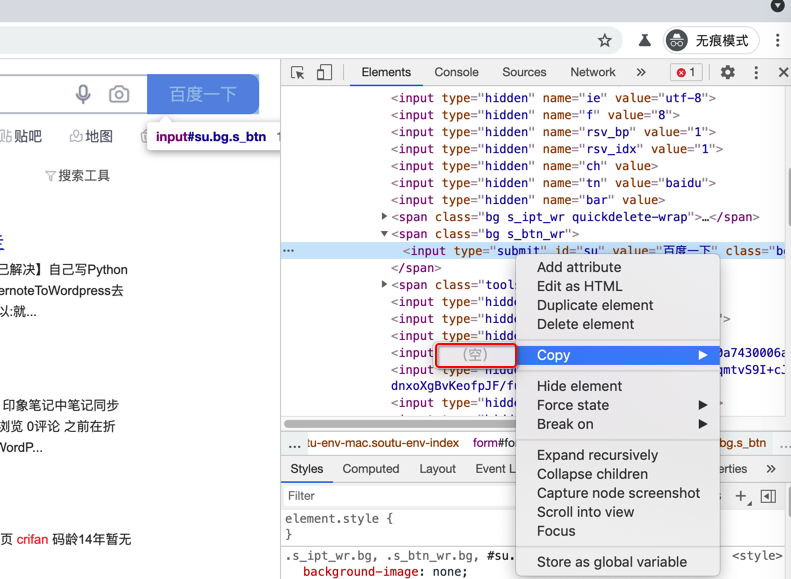
> 
