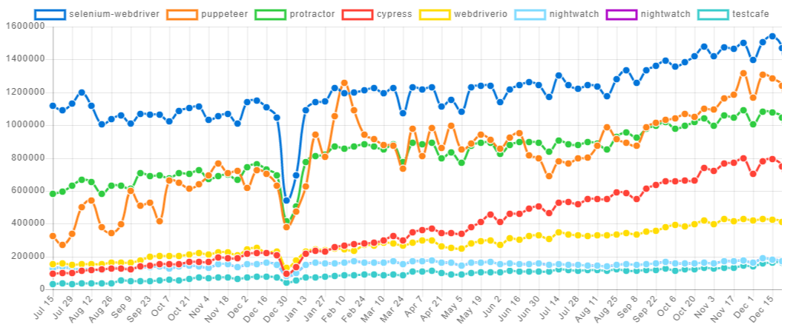
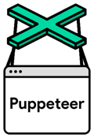

# Web端

* Web端自动化操作
  * 目的：模拟人手工去操作浏览器
* 常见框架有
  * [Selenium](http://book.crifan.com/books/selenium_summary/website)
  * [puppeteer](https://book.crifan.com/books/web_automation_tool_puppeteer/website/)
  * [Playwright](https://book.crifan.com/books/web_automation_tool_playwright/website/)

## Selenium vs puppeteer

下面总结一下相关对比：

* 两者趋势
  * 

具体区别：

* `Selenium`
  * Logo
    * 
  * 有些网站能检测到是WebDriver，就无法继续爬取了
    * 注：通过`webdriver`对浏览器的每一步操作都会留下特殊的痕迹，会被很多网站识别到
      * 规避办法：必须通过重新编译chrome的webdriver才能实现
        * 麻烦得让人想哭
    * 某人评论：Selenium速度慢，现在都改用`puppeteer`了
  * 资料
    * 官网
      * [SeleniumHQ Browser Automation](https://www.selenium.dev)
      * Python版本
        * PyPI
          * [selenium · PyPI](https://pypi.org/project/selenium/)
        * 文档
          * [Selenium with Python — Selenium Python Bindings 2 documentation](https://selenium-python.readthedocs.io)
  * `webdriver`
    * 常见
      * Phantomjs
        * [官网](http://phantomjs.org/)
    * 资料
      * [selenium-webdriver](https://www.selenium.dev/selenium/docs/api/javascript/)
  * 优势
    * 历史悠久：2004年发布
      * 目前最主流的浏览器（web页面）自动化工具
    * 支持众多浏览器：`Chrome`、`Firefox`、`Safari`、`IE`、`Opera`等
    * 支持众多编程语言：`Java`、`C#`、`Python`、`Ruby`等
    * 通过`Selenium IDE`支持录制功能
    * 支持测试平台：`Web`、（通过`Appium`）支持移动端
  * 缺点
    * 速度相对(`Puppeteer`)慢一点
    * 安装和设置相对(`Puppeteer`)麻烦一些
    * 不支持跨平台
    * 截图只支持图片
* `Puppeteer`
  * Logo
    * 
  * 发布时间：2017年
  * 开发者：`Google`
  * 目标：简化前端测试(front-end test)和开发
  * 支持浏览器：`Chrome`、`Chromium`
  * 支持语言：`Javascript`(`Node.js`)
  * 优势
    * 速度相对快一些
    * 安装和设置相对简单
    * 支持跨平台
    * 截图支持图片和PDF
  * 缺点
    * 测试平台只支持：`Web`
  * 相关
    * `pyppeteer`
      * 是什么：`Puppeteer`的`python`的`binding`
        * Unofficial Python port of puppeteer JavaScript (headless) chrome/chromium browser automation library
      * 好处
        * 可以绕过很多网站对于WebDriver的检测
        * 可以对`js加密`降维打击
          * 完全无视`js加密`手段
      * 文档
        * [API Reference — Pyppeteer 0.0.25 documentation](https://miyakogi.github.io/pyppeteer/reference.html)
      * 官网
        * GitHub
          * [miyakogi/pyppeteer: Headless chrome/chromium automation library (unofficial port of puppeteer)](https://github.com/miyakogi/pyppeteer)
          * 注：代码已归档，变只读了
        * pypi
          * [pyppeteer · PyPI](https://pypi.org/project/pyppeteer/)
