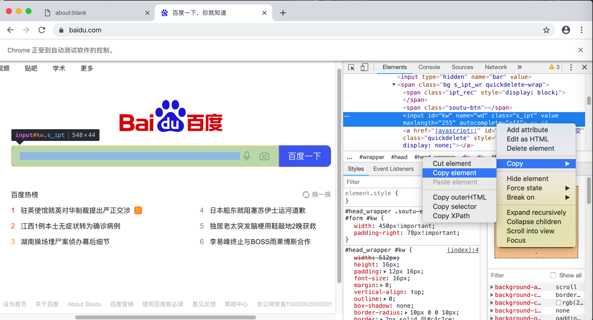
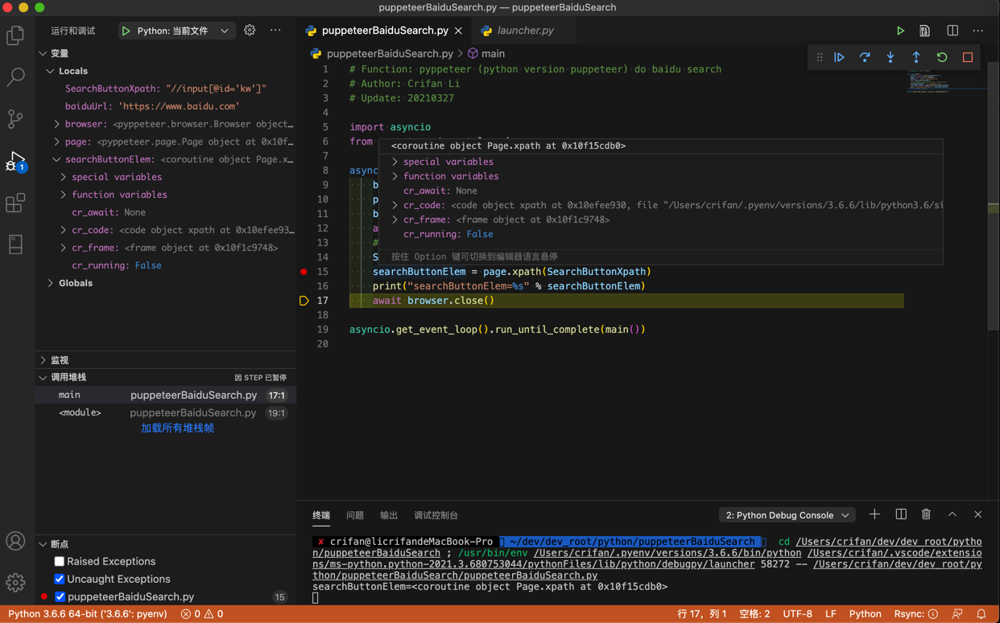
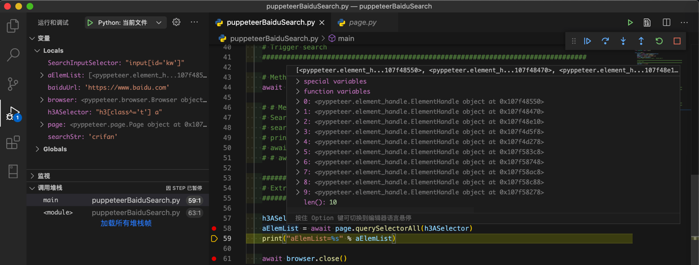

# 查找定位元素

查找元素相关函数：

* `pyppeteer`
  * `Page.querySelector()`
    * 别名：`Page.J()`
  * `Page.querySelectorAll()`
    * 别名：`Page.JJ()`
  * `Page.xpath()`
    * 别名：`Page.Jx()`

## 单个查找`xpath`

对于页面：



对应html：

```html
<input id="kw" name="wd" class="s_ipt" value="" maxlength="255" autocomplete="off">
```

代码：

```python
    SearchButtonXpath = "//input[@id='kw']"
    searchButtonElem = page.xpath(SearchButtonXpath)
    print("searchButtonElem=%s" % searchButtonElem)
```

输出：

```bash
searchButtonElem=<coroutine object Page.xpath at 0x10f15cdb0>
```

调试效果：



## 批量查找`querySelectorAll`

对于html

```html
<h3 class="t"><a data-click="{
    'F':'778317EA',
    'F1':'9D73F1E4',
    'F2':'4CA6DE6B',
    'F3':'54E5243F',
    'T':'1616767238',
        'y':'EFBCEFBE'
            }" href="https://www.baidu.com/link?url=nDSbU9I2MSInD6Tq7Je06wZD-CiTQ-ckokscP4kiXneJcS0UWUPIqWHMjLDyn5uW&wd=&eqid=919e8ff000236bc300000004605de906" target="_blank"><em>crifan</em> (<em>Crifan</em> Li) · GitHub</a></h3>
```

想要查找=定位（所有的）元素 `a`

```python
    h3ASelector = "h3[class^='t'] a"
    aElemList = await page.querySelectorAll(h3ASelector)
    print("aElemList=%s" % aElemList)
```

即可找到元素：



