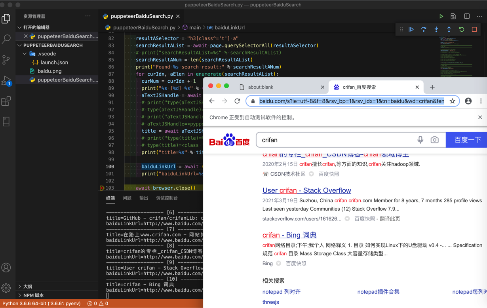

# 获取元素属性

获取元素属性可以用：`someElement.getProperty('propertyName')`

举例：

```html
<h3 class="t"><a data-click="{
    'F':'778317EA',
    'F1':'9D73F1E4',
    'F2':'4CA6DE6B',
    'F3':'54E5243F',
    'T':'1616767238',
        'y':'EFBCEFBE'
            }" href="https://www.baidu.com/link?url=nDSbU9I2MSInD6Tq7Je06wZD-CiTQ-ckokscP4kiXneJcS0UWUPIqWHMjLDyn5uW&wd=&eqid=919e8ff000236bc300000004605de906" target="_blank"><em>crifan</em> (<em>Crifan</em> Li) · GitHub</a></h3>
```

中的`a`元素中的`href`和文本值

对于已经找到元素的列表：

```python
    resultASelector = "h3[class^='t'] a"
    searchResultAList = await page.querySelectorAll(resultASelector)
    # print("searchResultAList=%s" % searchResultAList)
    searchResultANum = len(searchResultAList)
    print("Found %s search result:" % searchResultANum)
```

后去获取文本值`text`和属性值`href`：

```python
    for curIdx, aElem in enumerate(searchResultAList):
      curNum = curIdx + 1
      print("%s [%d] %s" % ("-"*20, curNum, "-"*20))
      aTextJSHandle = await aElem.getProperty('textContent')
      # print("type(aTextJSHandle)=%s" % type(aTextJSHandle))
      # type(aTextJSHandle)=<class 'pyppeteer.execution_context.JSHandle'>
      # print("aTextJSHandle=%s" % aTextJSHandle)
      # aTextJSHandle=<pyppeteer.execution_context.JSHandle object at 0x10309c9b0>
      title = await aTextJSHandle.jsonValue()
      # print("type(title)=%s" % type(title))
      # type(title)=<class 'str'>
      print("title=%s" % title)

      baiduLinkUrl = await (await aElem.getProperty("href")).jsonValue()
      print("baiduLinkUrl=%s" % baiduLinkUrl)
```

输出：

```bash
Found 10 search result:
-------------------- [1] --------------------
title=在路上on the way - 走别人没走过的路,让别人有路可走
baiduLinkUrl=http://www.baidu.com/link?url=eGTzEXXlMw-hnvXYSFk8t4VSZPck1dougn7YhfCwBf3ZzGJEHdZYsoAQK-4GBJuP
-------------------- [2] --------------------
title=crifan – 在路上
baiduLinkUrl=http://www.baidu.com/link?url=l6jXejlgARrWj34ODgKWZ9BeNKwyYZLRhLb5B8oDFVqNpHoco8a_qbAdD1m-t_cf
...
```

效果：



