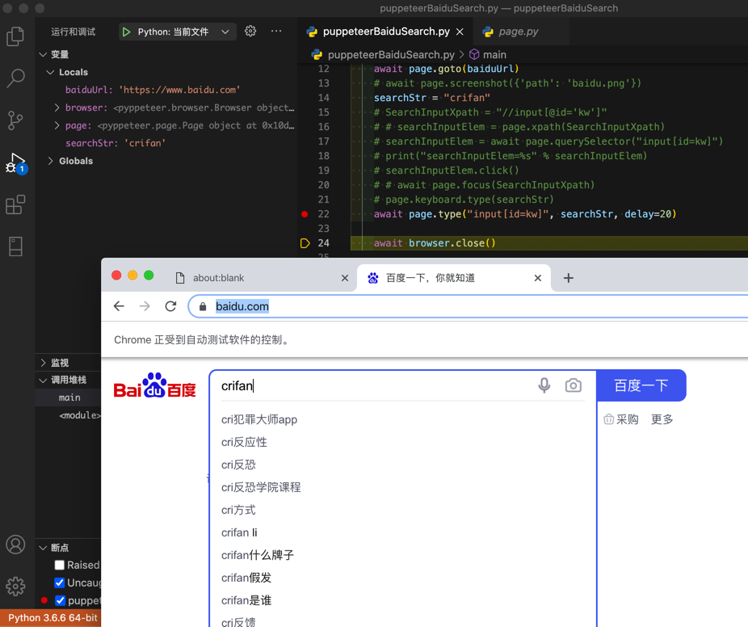

# 输入文字

对于页面元素：

```html
<input id="kw" name="wd" class="s_ipt" value="" maxlength="255" autocomplete="off">
```

想要输入文字

> #### warning:: 不支持定位元素再输入
> 
> 此处，无需，也没法实现：**先定位元素，再输入**
> 
> 而是，只支持：**直接定位并输入**

## 多种实现方式

### 方式1：先`Selector`定位，再`type`输入

定位此处只适合用：`Selector`，具体写法是：

```python
"input[id='kw']"
```

然后输入是用`type`函数

完整代码：

```python
searchStr = "crifan"
SearchInputSelector = "input[id='kw']"

await page.type(SearchInputSelector, searchStr, delay=20)
```

### 方式2：先`focus`，再`keyboard`的`type`

先（通过selector）focus，再（用keyboard）type

完整代码：

```python
    searchStr = "crifan"
    SearchInputSelector = "input[id='kw']"

    await page.focus(SearchInputSelector)
    await page.keyboard.type(searchStr)
```

### 方式3：先`focus`，再`click`，最后用`keyboard`的`type`

先`selector`，再click（类似于focus），最后用keyboard输入type

完整代码：

```python
searchStr = "crifan"
SearchInputSelector = "input[id='kw']"

searchInputElem = await page.querySelector(SearchInputSelector)
await searchInputElem.click()
await page.keyboard.type(searchStr)
```

## 效果

百度首页的输入框中，输入了字符串`crifan`后的效果：



## 注意事项

### 加记得加`await`

注意：一定要加await，否则：代码运行无效果。

且还会报警告：

```bash
/Users/crifan/dev/dev_root/python/puppeteerBaiduSearch/puppeteerBaiduSearch.py:18: RuntimeWarning: coroutine 'ElementHandle.click' was never awaited
  searchInputElem.click()
```

## 相关文档

* coroutine type(selector: str, text: str, options: dict = None, **kwargs) → None[source]  API Reference — Pyppeteer 0.0.25 documentation
  * https://miyakogi.github.io/pyppeteer/reference.html#pyppeteer.page.Page.type

