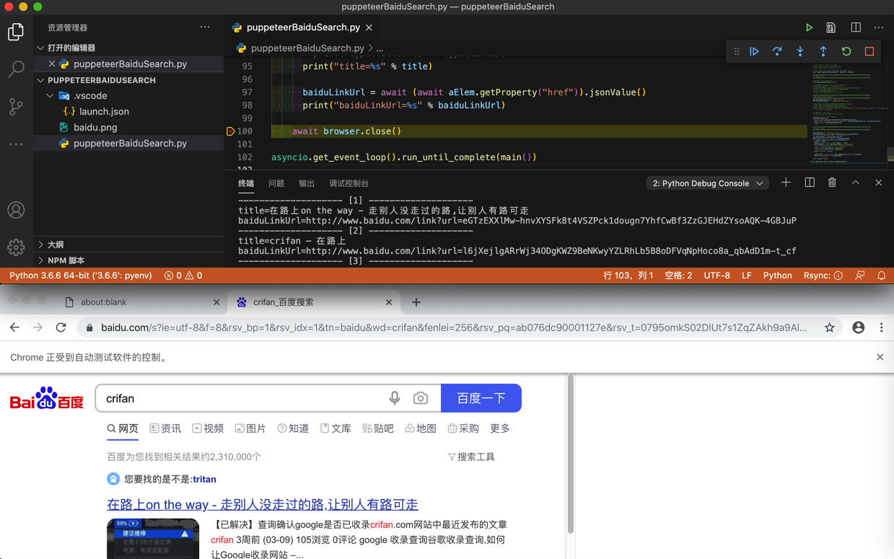
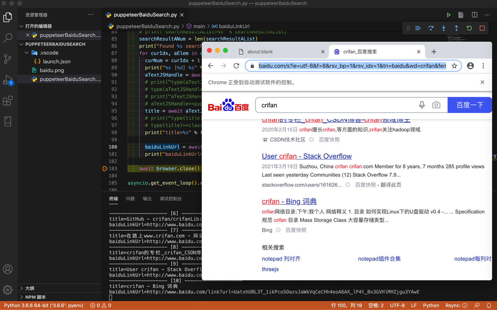

# 百度搜索自动化

此处给出用`puppeteer`模拟百度搜索，即百度搜索自动化的完整例子。

## 代码

* 文件下载：[puppeteerDemoBaiduSearch.py](../../../../assets/file/baiduSearchAutomation/puppeteer/puppeteerDemoBaiduSearch.py)
* 贴出代码

```python
# Function: pyppeteer (python version puppeteer) do baidu search
# Author: Crifan Li
# Update: 20210330

import asyncio
from pyppeteer import launch

async def main():
    browser = await launch(headless=False)
    page = await browser.newPage()

    await page.setJavaScriptEnabled(enabled=True)

    baiduUrl = "https://www.baidu.com"
    await page.goto(baiduUrl)
    # await page.screenshot({'path': 'baidu.png'})

    ################################################################################
    # Input text
    ################################################################################
    searchStr = "crifan"

    # SearchInputSelector = "input[id=kw]"
    SearchInputSelector = "input[id='kw']"

    # SearchInputXpath = "//input[@id='kw']"
    # searchInputElem = page.xpath(SearchInputXpath)

    # # Input method 1: selector + click + keyboard type
    # searchInputElem = await page.querySelector(SearchInputSelector)
    # print("searchInputElem=%s" % searchInputElem)
    # await searchInputElem.click()
    # await page.keyboard.type(searchStr)

    # Input method 2: focus then type
    # await page.focus(SearchInputSelector)
    # await page.keyboard.type(searchStr)

    # Input method 3: selector and input once using type
    await page.type(SearchInputSelector, searchStr, delay=20)

    ################################################################################
    # Trigger search
    ################################################################################

    # Method 1: press ENTER key
    await page.keyboard.press('Enter')

    # # Method 2: locator search button then click
    # SearchButtonSelector = "input[id='su']"
    # searchButtonElem = await page.querySelector(SearchButtonSelector)
    # print("searchButtonElem=%s" % searchButtonElem)
    # await searchButtonElem.click()
    # # await searchButtonElem.press("Enter")

    ################################################################################
    # Wait page reload complete
    ################################################################################
    SearchFoundWordsSelector = 'span.nums_text'
    SearchFoundWordsXpath = "//span[@class='nums_text']"

    # await page.waitForSelector(SearchFoundWordsSelector)
    # await page.waitFor(SearchFoundWordsSelector)
    # await page.waitForXPath(SearchFoundWordsXpath)
    # Note: all above exception: 发生异常: ElementHandleError Evaluation failed: TypeError: MutationObserver is not a constructor
    #   so change to following

    # # Method 1: just wait
    # await page.waitFor(2000) # millisecond

    # Method 2: wait element showing
    SingleWaitSeconds = 1
    while not await page.querySelector(SearchFoundWordsSelector):
      print("Still not found %s, wait %s seconds" % (SearchFoundWordsSelector, SingleWaitSeconds))
      await asyncio.sleep(SingleWaitSeconds)
      # pass

    ################################################################################
    # Extract result
    ################################################################################

    resultASelector = "h3[class^='t'] a"
    searchResultAList = await page.querySelectorAll(resultASelector)
    # print("searchResultAList=%s" % searchResultAList)
    searchResultANum = len(searchResultAList)
    print("Found %s search result:" % searchResultANum)
    for curIdx, aElem in enumerate(searchResultAList):
      curNum = curIdx + 1
      print("%s [%d] %s" % ("-"*20, curNum, "-"*20))
      aTextJSHandle = await aElem.getProperty('textContent')
      # print("type(aTextJSHandle)=%s" % type(aTextJSHandle))
      # type(aTextJSHandle)=<class 'pyppeteer.execution_context.JSHandle'>
      # print("aTextJSHandle=%s" % aTextJSHandle)
      # aTextJSHandle=<pyppeteer.execution_context.JSHandle object at 0x10309c9b0>
      title = await aTextJSHandle.jsonValue()
      # print("type(title)=%s" % type(title))
      # type(title)=<class 'str'>
      print("title=%s" % title)

      baiduLinkUrl = await (await aElem.getProperty("href")).jsonValue()
      print("baiduLinkUrl=%s" % baiduLinkUrl)

    await browser.close()

asyncio.get_event_loop().run_until_complete(main())
```

## 效果

### 视频

<video id="puppeteerDemoBaiduSearch" controls="controls" preload="none" width="800" height="600">
  <source src="../../../../assets/file/baiduSearchAutomation/puppeteer/puppeteerDemoBaiduSearch.mp4" type="video/mp4">
</video>

### 图





### 输出

```bash
Still not found span.nums_text, wait 1 seconds
Found 10 search result:
-------------------- [1] --------------------
title=在路上on the way - 走别人没走过的路,让别人有路可走
baiduLinkUrl=http://www.baidu.com/link?url=eGTzEXXlMw-hnvXYSFk8t4VSZPck1dougn7YhfCwBf3ZzGJEHdZYsoAQK-4GBJuP
-------------------- [2] --------------------
title=crifan – 在路上
baiduLinkUrl=http://www.baidu.com/link?url=l6jXejlgARrWj34ODgKWZ9BeNKwyYZLRhLb5B8oDFVqNpHoco8a_qbAdD1m-t_cf
-------------------- [3] --------------------
title=crifan简介_crifan的专栏-CSDN博客_crifan
baiduLinkUrl=http://www.baidu.com/link?url=IIqPM5wuVE_QP7S357-1bJWGGU1kpFcAZ945BaXUQNpaDzXihf_98wAVi05Gk6-8Qu4aGLv2Rv65WJm6Qr5kk_
-------------------- [4] --------------------
title=crifan的微博_微博
baiduLinkUrl=http://www.baidu.com/link?url=NnqeMlu4Jr_Ld-zoui8pbQO4eRMMO9pLd_DHXagqcdZ46NF4CSuyEziKSTpqCNEi
-------------------- [5] --------------------
title=Crifan的电子书大全 | crifan.github.io
baiduLinkUrl=http://www.baidu.com/link?url=uOZ-AmgNBNr3mGdETezIjTvtedH_ueM6-LNOc2QxbjcNeS8LuVBY-kirwogX7qLl
-------------------- [6] --------------------
title=GitHub - crifan/crifanLib: crifan's library
baiduLinkUrl=http://www.baidu.com/link?url=t42I1rYfn32DGw9C6cw_5lB-z1worKzEuROOtWj-Jyf1l2IBNBcz-l85hSKv9s9T
-------------------- [7] --------------------
title=在路上www.crifan.com - 网站排行榜
baiduLinkUrl=http://www.baidu.com/link?url=WwLwfXA72vK08Obyx2hwqA3-wmq8jAisi4VVSt2R0Ml3ccCy_yxeYfxD2xouAX-i5AyUU1U_2EghwVbJ2p-ipa
-------------------- [8] --------------------
title=crifan的专栏_crifan_CSDN博客-crifan领域博主
baiduLinkUrl=http://www.baidu.com/link?url=Cmcn2mXwiZr87FBGQBq85Np0hgGTP_AK2yLUW6GDeA21r7Q5WvUOUjaKZo5Jhb0f
-------------------- [9] --------------------
title=User crifan - Stack Overflow
baiduLinkUrl=http://www.baidu.com/link?url=yGgsq1z2vNDAAeWY-5VDWbHv7e7zPILHI4GVFPZd6MaFrGjYHsb3Onir1Vi6vvZqD7QAGJrZehIYZpcBfh_Gq_
-------------------- [10] --------------------
title=crifan - Bing 词典
baiduLinkUrl=http://www.baidu.com/link?url=UatxhUBL3T_1ikPco5OazvJaWkVqCeCHh4eoA6AX_lP4t_Bx3GVHlMHZjgu3YAwE
```


