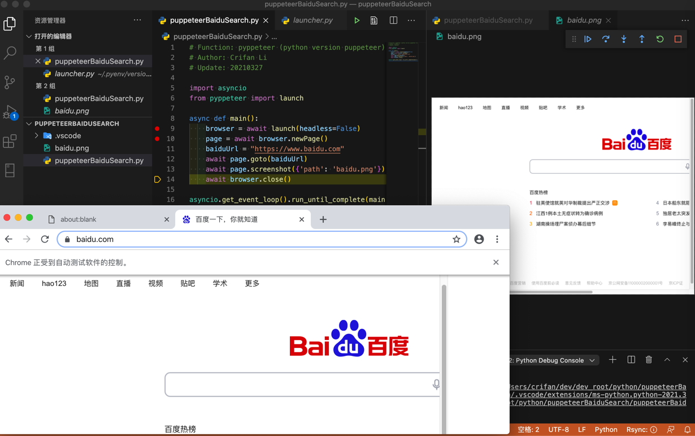
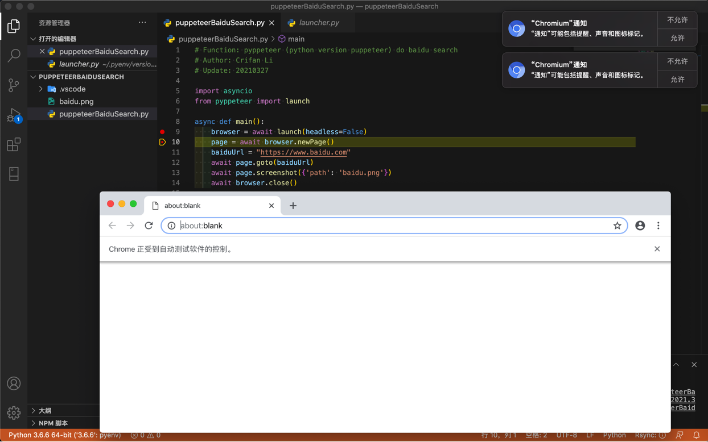

# 初始化环境

此处介绍如何（在Mac中）初始化`pyppeteer`开发环境。

## 下载和安装`pyppeteer`

* Mac中安装`pyppeteer`
    ```bash
    pip install pyppeteer
    ```
* 用`pyppeteer-install`去下载浏览器内核
    ```bash
    pyppeteer-install
    ```
  * 可以看到下载了chrome
    * 此处位置是：`/Users/crifan/Library/Application Support/pyppeteer/local-chromium/588429`

## 测试代码

```python
import asyncio
from pyppeteer import launch

async def main():
    browser = await launch(headless=False)
    page = await browser.newPage()
    baiduUrl = "https://www.baidu.com"
    await page.goto(baiduUrl)
    await page.screenshot({'path': 'baidu.png'})
    await browser.close()

asyncio.get_event_loop().run_until_complete(main())
```

即可，启动Chromium浏览器，并打开百度，和本地截图：



## 常见问题

### pyppeteer代码正常运行，但没有启动Chrome浏览器

**现象**：`pyppeteer`代码

```python
browser = await launch()
```

是正常运行了，但是没看到Chrome浏览器启动

**原因**：puppeteer（pyppeteer）默认是启动 无头模式，所以内部其实启动了，只是没有界面显示，即看不到Chrome浏览器启动而已。

**解决办法**：加上参数，取消无头模式

代码：

```python
browser = await launch(headless=True)
```

即可看到Chrome浏览器



> #### info:: 参数传递方式也可以用dict字典方式
> 也可以写成dict字典的方式传参
```python
browser = await launch({'headless': False})
```
> 效果是一样的
