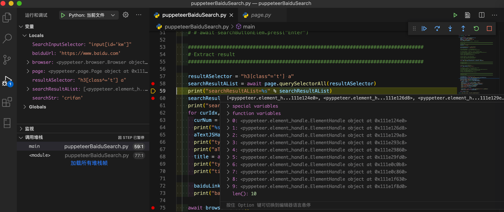
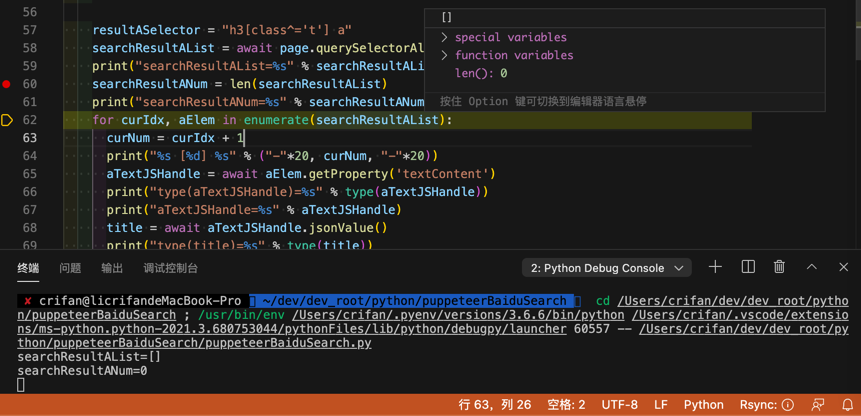

# 等待元素出现

**现象**：代码：

```python
    resultASelector = "h3[class^='t'] a"
    searchResultAList = await page.querySelectorAll(resultASelector)
```

调试时可以正常运行，可以找到元素：



直接运行时，却找不到元素了：



**原因**：页面重新加载了，但是内容还没显示出来。所以找不到元素。

**解决办法**：等待页面加载完毕。再去查找元素，就可以找到了。

## 如何确保页面加载完毕？

**核心逻辑**：找到页面加载完毕，一定会显示（出现）的元素，去等待其出现，即可。

此处，百度搜索后，一定会出现（显示）的元素是：

```html
<span class="nums_text">百度为您找到相关结果约2,370,000个</span>
```

对应等待元素出现的代码是：

```python
    SearchFoundWordsSelector = 'span.nums_text'
    SearchFoundWordsXpath = "//span[@class='nums_text']"

    # Method 2: wait element showing
    SingleWaitSeconds = 1
    while not await page.querySelector(SearchFoundWordsSelector):
      print("Still not found %s, wait %s seconds" % (SearchFoundWordsSelector, SingleWaitSeconds))
      await asyncio.sleep(SingleWaitSeconds)
```

> #### danger:: `waitFor`系列的所有函数都无效
> 经过实际测试，`waitFor`系列的各个函数，此处都无效
```python
    # await page.waitForSelector(SearchFoundWordsSelector)
    # await page.waitFor(SearchFoundWordsSelector)
    # await page.waitForXPath(SearchFoundWordsXpath)
    # Note: all above exception: 发生异常: ElementHandleError Evaluation failed: TypeError: MutationObserver is not a constructor
```
> 都会报错：`ElementHandleError Evaluation failed: TypeError: MutationObserver is not a constructor`
